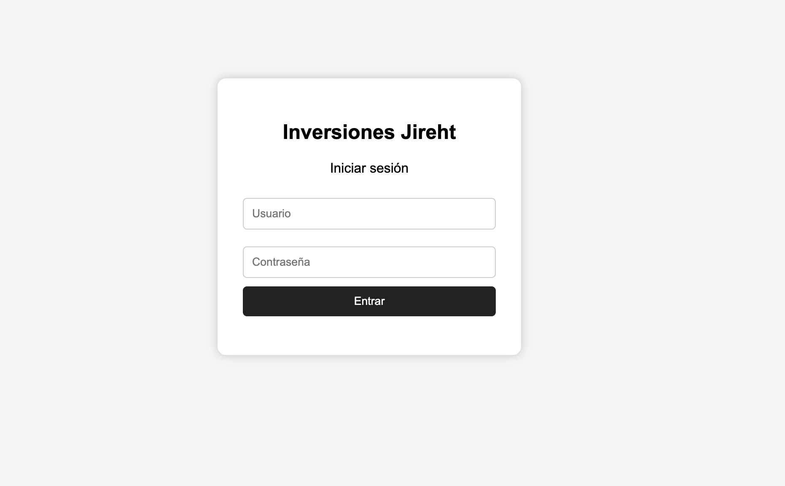
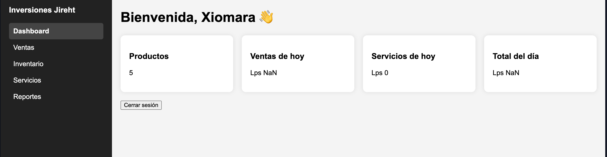

# Sistema de Gestión para Inversiones Jireht

## Descripción

Sistema web desarrollado para administrar el inventario, ventas y servicios de Inversiones Jireht.

El proyecto surge a partir de una entrevista realizada a la propietaria del negocio, quien manifestó dificultades para gestionar manualmente el inventario y mantener un control ordenado de los productos.

##  Problema Identificado

Actualmente el inventario se realiza manualmente, lo que provoca:

- Dificultad para conocer el stock disponible.
- Tiempo excesivo realizando inventarios.
- Riesgo de agotamiento de productos.
- Procesos poco organizados.

## Objetivo

Desarrollar un sistema web que permita:

- Gestionar inventario.
- Registrar ventas.
- Registrar servicios.
- Generar reportes diarios.
- Mejorar la organización del negocio.

## 🛠️ Tecnologías Utilizadas

- HTML5
- CSS3
- JavaScript
- LocalStorage

##  Módulos del Sistema

* **Login:** Acceso seguro al sistema.
* **Dashboard:** Resumen general y estadísticas del negocio.
* **Inventario:** Gestión, control y seguimiento de productos.
* **Ventas:** Registro y control de ventas realizadas.
* **Servicios:** Registro de los servicios ofrecidos.
* **Reportes:** Visualización de estadísticas y reportes diarios.

##  Vista Previa del Sistema

| Módulo de Login | Panel Principal (Dashboard) |
|:---:|:---:|
|  |  |

##  Autor

* **William Saavedra**
* Proyecto de Ingeniería de Software I 